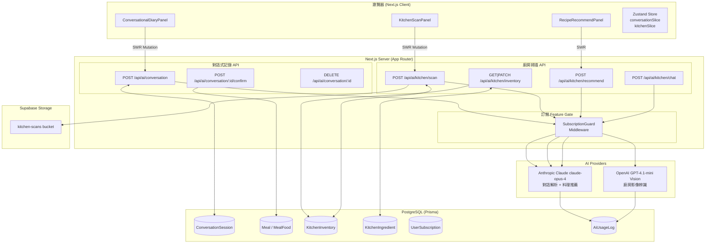

# OpenSpec Proposal：AI 對話式飲食日記 & 廚房掃描料理推薦

**變更名稱**：`ai-conversational-diary-kitchen-scan`  
**日期**：2026-05-12  
**作者**：Product Engineering  
**狀態**：Draft  
**優先級**：P0（核心 AI 差異化功能）

---

## 1. Overview

### 1.1 Problem Statement

現有 CalorieCount 的飲食記錄流程需要用戶主動拍照辨識或手動搜尋食物，有兩個明顯痛點：

1. **記錄摩擦高**：用戶在餐後需開啟 App → 進入記錄 → 拍照或搜尋 → 確認每項食物 → 選擇份量，步驟繁多，導致漏記率高。台灣飲食文化以混合菜色（便當、麵食、湯品）為主，一餐可能含 5–8 種食材，手動記錄耗時更長。

2. **缺乏主動飲食建議**：App 只會在吃完後記錄，無法在烹飪前提供符合當日營養目標的建議，錯失在「食物選擇決策點」介入的機會。

### 1.2 Goals

**Feature 1：對話式飲食日記**

- 讓用戶用最自然的方式描述剛吃的食物，無需切換到拍照或搜尋界面
- 支援台灣本地飲食描述（牛肉麵、便當、珍奶等）的精確解析
- 實現 < 3 步驟完成一餐記錄（輸入 → 確認 → 儲存）
- 支援修正對話（「不對，是大碗」），降低錯誤記錄率

**Feature 2：廚房掃描 → 今日料理推薦**

- 讓用戶透過拍攝冰箱/食材，一次性建立食材庫存
- 根據現有食材 + 今日剩餘營養缺口，自動推薦 2–3 道最適合的料理
- 讓用戶在「決定今天煮什麼」的時刻，做出更符合健康目標的選擇

**訂閱制（為未來版本預留架構）**

- 建立 Free / Premium / Pro 三層訂閱架構
- AI 功能（對話記錄、廚房掃描）作為 Premium+ 功能進行 Feature Gate
- 追蹤每用戶 AI 用量，支援用量限制與 Upgrade 提示

### 1.3 Non-Goals

- **不實作語音輸入**（Phase 1 僅文字；語音作為 Phase 3 extension）
- **不建立食譜資料庫**（料理推薦由 AI 即時生成，不預存食譜）
- **不實作食材採購建議**（僅推薦現有食材可做的料理）
- **不整合 LIFF**（現有 Web App 優先，LINE 整合為後續 Phase）
- **不實作 Stripe 金流**（訂閱架構預留，付款整合為獨立 Change）

### 1.4 Success Metrics

| 指標 | 基準線 | 30 天目標 | 90 天目標 |
|------|--------|-----------|-----------|
| 平均每用戶每日記錄餐數 | 1.2 餐 | 1.8 餐 (+50%) | 2.5 餐 (+108%) |
| 對話記錄完成率 | N/A | > 70% | > 80% |
| 廚房掃描週使用率 | N/A | > 15% | > 30% |
| AI 解析誤差率（±10% 熱量） | N/A | < 25% | < 15% |
| 訂閱轉換率（Free → Premium） | 0% | 3% | 8% |
| D7 留存率 | 35% | 45% | 55% |

---

## 2. User Stories

### Feature 1：對話式飲食日記

**US-1**：As a **busy office worker**, I want to **type "剛吃了排骨便當，飲料只喝一半"** and have the system automatically parse all food items and nutrition data, so that **I can log my lunch in under 30 seconds without searching manually**.

**US-2**：As a **user who estimated portion sizes**, I want to **say "不對，那個白飯是小碗"** in follow-up messages and have the system update the previous parsing, so that **my records accurately reflect what I actually ate**.

**US-3**：As a **health-conscious user**, I want to **see a structured breakdown of each parsed food item** (name, portion, calories, macros) before confirming, so that **I can verify the AI's interpretation is correct before committing to the record**.

**US-4**：As a **user recording a late-night snack**, I want the system to **automatically detect that it's 11 PM and suggest "點心"** as the meal type, so that **I don't have to manually select the category each time**.

**US-5**：As a **Premium subscriber**, I want to **chat with my daily nutrition summary** (e.g., "今天蛋白質夠了嗎？"), so that **I can get personalized nutrition insight without leaving the App**.

### Feature 2：廚房掃描 → 今日料理推薦

**US-6**：As a **home cook**, I want to **take 2–3 photos of my fridge and pantry** and see an AI-generated ingredient list I can edit, so that **I don't have to manually type every ingredient in my kitchen**.

**US-7**：As a **user trying to hit today's protein goal**, I want to **receive 2–3 recipe recommendations that use my available ingredients and help close my remaining nutrition gap**, so that **I can cook a meal that's both convenient and goal-aligned**.

**US-8**：As a **user who just used some ingredients**, I want to **type "雞蛋用完了，剛買了一塊豆腐"** and have the inventory automatically update, so that **I don't need to go back into the scan flow for minor changes**.

**US-9**：As a **Premium subscriber**, I want to **see the estimated calories and macros for each recommended recipe** displayed prominently, so that **I can make an informed choice before I start cooking**.

---

## 3. Technical Architecture

### 3.1 System Diagram



### 3.2 API Endpoints（OpenAPI 3.0）

```yaml
openapi: "3.0.3"
info:
  title: CalorieCount AI Features API
  version: "1.0.0"

paths:
  /api/ai/conversation:
    post:
      summary: 發送對話訊息（新建或繼續對話）
      security:
        - sessionAuth: []
      requestBody:
        required: true
        content:
          application/json:
            schema:
              type: object
              required: [message]
              properties:
                message:
                  type: string
                  description: 用戶輸入的自然語言描述
                  example: "剛吃了一碗牛肉麵，湯喝了一半"
                sessionId:
                  type: string
                  description: 繼續現有對話（省略則新建）
                mealDate:
                  type: string
                  format: date-time
                  description: 指定餐食時間（省略則使用當前時間）
      responses:
        "200":
          description: AI 解析結果
          content:
            application/json:
              schema:
                $ref: "#/components/schemas/ConversationTurn"
        "402":
          description: 超過免費配額，需升級
        "429":
          description: Rate limit exceeded

  /api/ai/conversation/{sessionId}/confirm:
    post:
      summary: 確認對話結果並寫入飲食記錄
      parameters:
        - name: sessionId
          in: path
          required: true
          schema:
            type: string
      requestBody:
        required: true
        content:
          application/json:
            schema:
              type: object
              required: [mealType, foods]
              properties:
                mealType:
                  $ref: "#/components/schemas/MealType"
                foods:
                  type: array
                  items:
                    $ref: "#/components/schemas/ParsedFood"
                mealDate:
                  type: string
                  format: date-time
      responses:
        "201":
          description: 飲食記錄已建立
          content:
            application/json:
              schema:
                type: object
                properties:
                  mealId:
                    type: string

  /api/ai/kitchen/scan:
    post:
      summary: 上傳廚房照片，AI 辨識食材
      security:
        - sessionAuth: []
      requestBody:
        required: true
        content:
          multipart/form-data:
            schema:
              type: object
              required: [images]
              properties:
                images:
                  type: array
                  items:
                    type: string
                    format: binary
                  maxItems: 5
      responses:
        "200":
          description: 辨識結果
          content:
            application/json:
              schema:
                $ref: "#/components/schemas/KitchenScanResult"

  /api/ai/kitchen/inventory:
    get:
      summary: 取得目前食材庫存
      responses:
        "200":
          content:
            application/json:
              schema:
                $ref: "#/components/schemas/KitchenInventory"
    patch:
      summary: 更新食材庫存（手動編輯）
      requestBody:
        required: true
        content:
          application/json:
            schema:
              type: object
              properties:
                additions:
                  type: array
                  items:
                    $ref: "#/components/schemas/KitchenIngredientInput"
                removals:
                  type: array
                  items:
                    type: string
                    description: ingredientId
                updates:
                  type: array
                  items:
                    $ref: "#/components/schemas/KitchenIngredientUpdate"

  /api/ai/kitchen/recommend:
    post:
      summary: 根據庫存與今日剩餘營養目標推薦料理
      requestBody:
        required: true
        content:
          application/json:
            schema:
              type: object
              properties:
                servings:
                  type: integer
                  default: 1
                  description: 幾人份
                preferences:
                  type: array
                  items:
                    type: string
                  example: ["低碳", "高蛋白", "快速料理"]
      responses:
        "200":
          content:
            application/json:
              schema:
                type: object
                properties:
                  recommendations:
                    type: array
                    items:
                      $ref: "#/components/schemas/RecipeRecommendation"
                  remainingNutrition:
                    $ref: "#/components/schemas/NutritionGap"

  /api/ai/kitchen/chat:
    post:
      summary: 用對話更新食材庫存
      requestBody:
        required: true
        content:
          application/json:
            schema:
              type: object
              required: [message]
              properties:
                message:
                  type: string
                  example: "雞蛋用完了，剛買了一塊豆腐"
      responses:
        "200":
          content:
            application/json:
              schema:
                type: object
                properties:
                  updatedInventory:
                    $ref: "#/components/schemas/KitchenInventory"
                  changes:
                    type: array
                    items:
                      type: string
                    description: 人類可讀的變更摘要

components:
  schemas:
    MealType:
      type: string
      enum: [BREAKFAST, LUNCH, DINNER, SNACK, OTHER]

    ParsedFood:
      type: object
      required: [name, portion, portionSize, portionUnit, calories, protein, carbs, fat]
      properties:
        name:
          type: string
          example: "牛肉麵"
        portion:
          type: string
          example: "一碗"
        portionSize:
          type: number
          example: 450
        portionUnit:
          type: string
          example: "g"
        calories:
          type: number
          example: 520
        protein:
          type: number
        carbs:
          type: number
        fat:
          type: number
        fiber:
          type: number
          nullable: true
        confidence:
          type: number
          minimum: 0
          maximum: 1
        isFuzzy:
          type: boolean
          description: 是否為模糊描述（如「大概半碗」）

    ConversationTurn:
      type: object
      properties:
        sessionId:
          type: string
        assistantMessage:
          type: string
          description: AI 的自然語言回應
        parsedFoods:
          type: array
          items:
            $ref: "#/components/schemas/ParsedFood"
        suggestedMealType:
          $ref: "#/components/schemas/MealType"
        needsClarification:
          type: boolean
          description: 是否需要用戶進一步確認
        clarificationPrompt:
          type: string
          nullable: true

    KitchenScanResult:
      type: object
      properties:
        inventoryId:
          type: string
        ingredients:
          type: array
          items:
            $ref: "#/components/schemas/KitchenIngredient"
        lowConfidenceItems:
          type: array
          items:
            type: string
          description: AI 不確定的食材名稱列表

    KitchenInventory:
      type: object
      properties:
        id:
          type: string
        lastScannedAt:
          type: string
          format: date-time
          nullable: true
        ingredients:
          type: array
          items:
            $ref: "#/components/schemas/KitchenIngredient"

    KitchenIngredient:
      type: object
      properties:
        id:
          type: string
        name:
          type: string
          example: "雞蛋"
        category:
          type: string
          example: "蛋白質"
        quantity:
          type: string
          example: "6個"
        isAvailable:
          type: boolean
        aiConfidence:
          type: number
        addedVia:
          type: string
          enum: [scan, chat, manual]

    KitchenIngredientInput:
      type: object
      required: [name]
      properties:
        name:
          type: string
        quantity:
          type: string
        category:
          type: string

    KitchenIngredientUpdate:
      type: object
      required: [id]
      properties:
        id:
          type: string
        quantity:
          type: string
        isAvailable:
          type: boolean

    RecipeRecommendation:
      type: object
      properties:
        name:
          type: string
          example: "蒜炒豆腐佐炒蛋"
        description:
          type: string
        cookingTime:
          type: integer
          description: 預估烹飪時間（分鐘）
        difficulty:
          type: string
          enum: [easy, medium, hard]
        matchedIngredients:
          type: array
          items:
            type: string
          description: 使用到的現有食材
        missingIngredients:
          type: array
          items:
            type: string
          description: 需額外購買的食材（盡量為空）
        instructions:
          type: array
          items:
            type: string
        nutrition:
          $ref: "#/components/schemas/NutritionInfo"
        nutritionFitScore:
          type: number
          minimum: 0
          maximum: 100
          description: 與今日剩餘目標的吻合度評分

    NutritionInfo:
      type: object
      properties:
        calories:
          type: number
        protein:
          type: number
        carbs:
          type: number
        fat:
          type: number

    NutritionGap:
      type: object
      description: 今日剩餘營養缺口
      properties:
        calories:
          type: number
        protein:
          type: number
        carbs:
          type: number
        fat:
          type: number
```

### 3.3 Data Schema（TypeScript Interface）

```typescript
// ─── 對話式飲食日記 ─────────────────────────────────────────

type ConversationStatus = 'active' | 'confirmed' | 'abandoned'
type MessageRole = 'user' | 'assistant'
type AddedVia = 'scan' | 'chat' | 'manual'

interface ConversationMessage {
  role: MessageRole
  content: string
  timestamp: Date
  parsedFoods?: ParsedFood[]
}

interface ParsedFood {
  name: string
  portion: string
  portionSize: number      // 數值份量
  portionUnit: string      // g, ml, 碗, 個...
  calories: number
  protein: number
  carbs: number
  fat: number
  fiber?: number
  confidence: number       // 0–1，AI 信心度
  isFuzzy: boolean         // true = 「大概半碗」這類模糊描述
}

interface ConversationSession {
  id: string
  userId: string
  status: ConversationStatus
  messages: ConversationMessage[]
  pendingFoods: ParsedFood[]
  suggestedMealType: MealType
  mealDate: Date           // 以第一則訊息時間為準
  expiresAt: Date          // TTL: 24 小時
  createdAt: Date
  updatedAt: Date
}

// ─── 廚房食材庫存 ─────────────────────────────────────────

type IngredientCategory =
  | '蛋白質'    // 雞肉、豆腐、蛋
  | '蔬菜'
  | '澱粉'     // 米飯、麵
  | '調味料'
  | '乳製品'
  | '水果'
  | '其他'

interface KitchenIngredient {
  id: string
  inventoryId: string
  name: string
  category: IngredientCategory
  quantity: string          // 描述性：「3個」「半袋」「約200g」
  isAvailable: boolean
  aiConfidence: number      // 掃描時的識別信心度
  addedVia: AddedVia
  scanImageUrl?: string     // 對應的掃描圖片 URL
  createdAt: Date
  updatedAt: Date
}

interface KitchenInventory {
  id: string
  userId: string
  scanImages: string[]      // 所有掃描圖片的 URL
  ingredients: KitchenIngredient[]
  lastScannedAt: Date | null
  createdAt: Date
  updatedAt: Date
}

// ─── 料理推薦 ─────────────────────────────────────────────

type RecipeDifficulty = 'easy' | 'medium' | 'hard'

interface RecipeRecommendation {
  name: string
  description: string
  cookingTime: number
  difficulty: RecipeDifficulty
  matchedIngredients: string[]
  missingIngredients: string[]
  instructions: string[]
  nutrition: {
    calories: number
    protein: number
    carbs: number
    fat: number
  }
  nutritionFitScore: number  // 0–100，與今日缺口的吻合度
}

// ─── 訂閱制（預留架構）────────────────────────────────────

type SubscriptionPlan = 'FREE' | 'PREMIUM' | 'PRO'
type SubscriptionStatus = 'active' | 'cancelled' | 'expired' | 'trialing'

interface UserSubscription {
  id: string
  userId: string
  plan: SubscriptionPlan
  status: SubscriptionStatus
  currentPeriodStart: Date
  currentPeriodEnd: Date
  cancelAtPeriodEnd: boolean
  // 付款整合預留
  stripeCustomerId?: string
  stripeSubscriptionId?: string
  createdAt: Date
  updatedAt: Date
}

// 每個 Plan 的 AI 功能配額
interface PlanQuota {
  conversationMessagesPerMonth: number   // FREE: 20, PREMIUM: 200, PRO: -1 (unlimited)
  kitchenScansPerMonth: number           // FREE: 3,  PREMIUM: 30,  PRO: -1
  recipeRecommendationsPerMonth: number  // FREE: 5,  PREMIUM: 60,  PRO: -1
}

const PLAN_QUOTAS: Record<SubscriptionPlan, PlanQuota> = {
  FREE:    { conversationMessagesPerMonth: 20,  kitchenScansPerMonth: 3,  recipeRecommendationsPerMonth: 5 },
  PREMIUM: { conversationMessagesPerMonth: 200, kitchenScansPerMonth: 30, recipeRecommendationsPerMonth: 60 },
  PRO:     { conversationMessagesPerMonth: -1,  kitchenScansPerMonth: -1, recipeRecommendationsPerMonth: -1 },
}
```

### 3.4 AI 整合設計

#### 3.4.1 AI Provider 選型

| 用途 | Provider | 模型 | 理由 |
|------|----------|------|------|
| 食物文字解析（對話） | Anthropic Claude | `claude-opus-4` | 中文理解優異，對話上下文維持能力強 |
| 多輪對話修正 | Anthropic Claude | `claude-opus-4` | 原生 Assistant API，符合 feature 需求 |
| 廚房影像辨識 | OpenAI | `gpt-4.1-mini` | 現有基礎建設，Vision 成本低 |
| 料理推薦（文字生成） | Anthropic Claude | `claude-opus-4` | 食譜生成與中文表達更自然 |

> **Assumption**：使用 `@anthropic-ai/sdk`，與現有 `openai` SDK 並存。成本差異詳見 Open Questions。

#### 3.4.2 對話式記錄 System Prompt

```
你是一位精通台灣飲食文化的營養師 AI，負責從用戶的自然語言描述中精確解析食物與營養資訊。

【回應規則】
1. 必須以 JSON 格式回應，結構如下
2. 使用繁體中文作為食物名稱
3. 對於台灣常見食物（牛肉麵、滷肉飯、雞排等），使用在地標準份量與熱量估算
4. 若描述模糊（「大概」「一點」「幾口」），isFuzzy 設為 true，並給出保守估算
5. 若食物資訊不足以估算，needsClarification 設為 true，並在 clarificationPrompt 中詢問

【JSON 結構】
{
  "assistantMessage": "我幫你記錄了...",  // 自然語言摘要
  "parsedFoods": [
    {
      "name": "牛肉麵",
      "portion": "一碗",
      "portionSize": 450,
      "portionUnit": "g",
      "calories": 520,
      "protein": 28,
      "carbs": 65,
      "fat": 15,
      "fiber": 3,
      "confidence": 0.85,
      "isFuzzy": false
    }
  ],
  "suggestedMealType": "LUNCH",
  "needsClarification": false,
  "clarificationPrompt": null
}

【餐別判斷邏輯】
- 05:00–10:30 → BREAKFAST
- 10:30–14:00 → LUNCH  
- 14:00–17:00 → SNACK
- 17:00–21:00 → DINNER
- 21:00–05:00 → SNACK（消夜）
當前時間：{{CURRENT_TIME}}
```

#### 3.4.3 料理推薦 System Prompt

```
你是一位台灣家常料理專家，根據現有食材和用戶的今日營養缺口，推薦最合適的料理。

【可用食材】
{{AVAILABLE_INGREDIENTS}}

【今日剩餘營養缺口】
- 熱量：還需 {{remaining_calories}} kcal
- 蛋白質：還需 {{remaining_protein}} g
- 碳水：還需 {{remaining_carbs}} g
- 脂肪：還需 {{remaining_fat}} g

【推薦規則】
1. 優先使用現有食材，missing_ingredients 盡量為空
2. 推薦 3 道料理，難度不同（easy/medium/hard 各一）
3. 每道料理的營養數值需與缺口吻合（不超過 20% 誤差）
4. nutritionFitScore = min(100, (1 - 偏差程度) × 100)
5. 步驟說明以台灣家常烹飪方式為主，簡潔可執行

【回應格式】
返回 JSON 陣列，每個元素符合 RecipeRecommendation 結構。
```

#### 3.4.4 Context Window 管理（多輪對話）

```typescript
// 最大保留 10 輪對話歷史，避免 token 超限
const MAX_HISTORY_TURNS = 10

function buildClaudeMessages(session: ConversationSession, newMessage: string) {
  const recentMessages = session.messages
    .slice(-MAX_HISTORY_TURNS * 2)  // 每輪 = user + assistant
    .map(m => ({ role: m.role, content: m.content }))
  
  return [
    ...recentMessages,
    { role: 'user' as const, content: newMessage }
  ]
}
```

---

## 4. Implementation Plan

### Phase 1：對話式飲食日記（預估 3 週）

**Deliverables**

1. `ConversationSession` Prisma model + migration
2. Anthropic SDK 整合（`lib/ai/claude-client.ts`）
3. Route Handlers: `POST /api/ai/conversation`, `POST /api/ai/conversation/[id]/confirm`
4. `ConversationalDiaryPanel` Client Component
5. Zustand `conversationSlice`
6. 訂閱 Feature Gate middleware（`SubscriptionGuard`）
7. `UserSubscription` Prisma model（schema + migration，不含付款邏輯）

**Week 1：後端 API**
- [ ] 安裝 `@anthropic-ai/sdk`
- [ ] 建立 `lib/ai/claude-client.ts`
- [ ] 新增 `ConversationSession` schema + `bun db:migrate`
- [ ] 實作 `POST /api/ai/conversation`（新建 session + 呼叫 Claude）
- [ ] 實作 `POST /api/ai/conversation/[id]/confirm`（寫入 Meal）
- [ ] 對話 usage 寫入 `AiUsageLog`

**Week 2：前端 UI**
- [ ] 設計 `ConversationalDiaryPanel` 介面（聊天氣泡 + 食物卡片預覽）
- [ ] 整合 SWR mutation 呼叫對話 API
- [ ] 實作確認流程（用戶可編輯 AI 解析結果後確認）
- [ ] 餐別選擇器（AI 建議 + 用戶可覆蓋）
- [ ] Loading 與 Error 狀態處理

**Week 3：Feature Gate + 整合測試**
- [ ] 新增 `UserSubscription` schema
- [ ] 實作 `SubscriptionGuard` middleware
- [ ] Free tier: 20 次/月限制 + Upgrade 提示
- [ ] 整合測試：10 個 edge case 場景（見 Section 5）
- [ ] i18n：補充 `zh-TW.json` / `en.json` / `ja.json` 翻譯

---

### Phase 2：廚房掃描 + 料理推薦（預估 3 週）

**Deliverables**

1. `KitchenInventory` + `KitchenIngredient` Prisma models + migration
2. Route Handlers: `POST /api/ai/kitchen/scan`, `GET|PATCH /api/ai/kitchen/inventory`, `POST /api/ai/kitchen/recommend`, `POST /api/ai/kitchen/chat`
3. `KitchenScanPanel` + `RecipeRecommendPanel` Client Components
4. 圖片上傳至 Supabase Storage `kitchen-scans` bucket

**Week 4：廚房掃描後端**
- [ ] 新增 `KitchenInventory` + `KitchenIngredient` schema + migration
- [ ] 實作 `POST /api/ai/kitchen/scan`（多張圖片 → GPT-4 Vision 辨識 → 回傳食材清單）
- [ ] Supabase Storage bucket `kitchen-scans` 設定
- [ ] 實作 `GET|PATCH /api/ai/kitchen/inventory`

**Week 5：料理推薦後端 + 對話庫存更新**
- [ ] 計算今日剩餘營養缺口（查詢 `DailyStats` + `UserGoals`）
- [ ] 實作 `POST /api/ai/kitchen/recommend`（Claude 料理推薦）
- [ ] 實作 `POST /api/ai/kitchen/chat`（NL → 庫存更新）

**Week 6：前端 UI + 整合**
- [ ] `KitchenScanPanel`：多張照片上傳 + 食材清單編輯 UI
- [ ] `RecipeRecommendPanel`：推薦卡片 + 營養對比顯示
- [ ] 對話式庫存更新 UI（附近幾處於 scan panel）
- [ ] 整合 Premium Feature Gate + Upgrade CTA
- [ ] i18n 補充 + 整合測試

---

### Phase 3：訂閱付款整合（獨立 Change，預留設計）

> 此 Phase 不在本 Change 範圍內，但 schema 與 feature gate 已在 Phase 1 中預留。

- Stripe / 綠界 / 藍新金流整合
- Webhook 處理訂閱狀態更新
- 訂閱管理頁面（升級/降級/取消）
- 發票 email 通知

---

## 5. Edge Cases & Risk

| # | 情境 | 風險等級 | 處理方式 |
|---|------|----------|----------|
| EC-1 | **極度模糊描述**：用戶輸入「吃了一些東西」 | 中 | `needsClarification: true`，AI 回覆「可以告訴我吃了什麼嗎？」，不強制解析 |
| EC-2 | **份量單位模糊**：「吃了大概半碗白飯」 | 低 | `isFuzzy: true`，使用保守中間值（半碗 ≈ 75g），信心度標示 < 0.7，UI 顯示⚠️提醒 |
| EC-3 | **Claude API Timeout（> 10s）** | 高 | 前端 10s timeout → 顯示「AI 反應慢，請稍候重試」；backend 設 Abortcontroller；不寫入資料庫 |
| EC-4 | **多輪對話修正衝突**：前一輪說「一碗」，後一輪說「大碗」 | 中 | 以最新一輪為準，完整重算所有食物；在 assistant message 中確認「我把白飯改成大碗了...」 |
| EC-5 | **跨日對話**：晚上 11:58 開始記錄，12:01 確認 | 低 | `mealDate` 以第一則訊息時間為準，確認時不重新計算日期 |
| EC-6 | **廚房照片光線不足 / 模糊** | 中 | Vision API 回傳低信心度食材進入 `lowConfidenceItems`；UI 顯示「以下食材不確定，請確認或刪除」 |
| EC-7 | **Claude Hallucination（幻覺）**：AI 捏造食物熱量 | 高 | 顯示信心度 badge；熱量超出常識範圍（> 1500 kcal 單品）時，前端顯示黃色警告；允許用戶編輯所有數值後再確認 |
| EC-8 | **用戶同時開多視窗操作同一 session** | 低 | session 以 `updatedAt` 做 optimistic concurrency check，409 Conflict 時回傳最新狀態讓前端重新整合 |
| EC-9 | **AI 超出月配額（Free tier）** | 中 | 呼叫前先查 `AiUsageLog` 本月用量；超過配額時 API 返回 `402 Payment Required`，前端顯示 Upgrade Modal |
| EC-10 | **廚房食材用完但未更新**：AI 推薦用到已耗盡食材 | 中 | 推薦時標示 `missingIngredients`；引導用戶「標記用完」；對話庫存更新功能設計降低摩擦 |

---

## 6. Open Questions

| # | 問題 | 影響 | 決策期限 |
|---|------|------|----------|
| OQ-1 | **AI Provider**：Feature 1 & 3 使用 Claude API（Anthropic）還是繼續用 OpenAI GPT-4o？Claude 中文理解更好但成本較高（claude-opus-4 約 $15/MTok input）。需進行成本試算。 | 架構、成本 | Phase 1 開始前 |
| OQ-2 | **語音輸入**：Phase 2 是否加入語音記錄？Web Speech API（免費，但精準度不穩）vs Whisper API（付費，\~$0.006/min）。台語、台灣腔識別率需實測。 | UX、成本 | Phase 2 規劃時 |
| OQ-3 | **對話歷史保留期**：`ConversationSession` 資料保留多久？24h（最小）vs 7天（方便回顧）。影響儲存費用與 PII 風險。 | 隱私、成本 | Phase 1 Week 1 |
| OQ-4 | **廚房庫存持久化**：庫存是否跨裝置同步？（需 DB）還是 localStorage？（零成本但不跨裝置）。台灣用戶多裝置使用率？ | UX、架構 | Phase 2 Week 4 開始前 |
| OQ-5 | **訂閱付款方式**：台灣市場首選綠界或藍新金流（本地化），還是 Stripe（工程友善但需境外)?  影響 Phase 3 實作複雜度 | 商業、合規 | Phase 3 規劃時 |
| OQ-6 | **Free tier 定義**：20 次 AI 訊息/月是否足夠驗證產品？用量太少 → 用戶感受不到價值；太多 → AI API 成本不可控。 | 商業模式 | Phase 1 Week 3 |
| OQ-7 | **食譜是否儲存**：料理推薦結果是否持久化到 DB？儲存 → 可「下次再做」功能；不儲存 → 架構最簡單。 | 功能、架構 | Phase 2 Week 5 |
